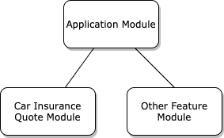

# REST API

## Scaffold Project via the CLI

Let's create our first NestJS application with the CLI.
```sh
nest new acme-api
```

You can also use shorthand syntax.

```sh
nest n acme-api
```

This command will initialize a new Nest project. It will prompt you to ask which package manager you prefer. 

```sh
? Which package manager would you ❤️  to use? (Use arrow keys)
  npm
❯ yarn
```

Let's choose `Yarn`. Let's grab a cup of coffee while the CLI generates the project.

```sh
▹▸▹▹▹ Installation in progress... ☕
```

After a few moments, your new project will be ready.

```sh
                          Thanks for installing Nest 🙏
                 Please consider donating to our open collective
                        to help us maintain this package.


                    🍷  Donate: https://opencollective.com/nest
```

## Project Structure

Let's explore the structure of our NestJS application. The CLI created a project directory called `acme-api`. Open up the `acme-api` folder in VS Code.

```sh
cd acme-api
code .
```

The required dependencies (`node_modules`) are already installed and a few boilerplate files were scaffolded as well. The `src/` directory contains several core files necessary for any NestJS application.

```
.
├── src
│   ├── app.controller.spec.ts
│   ├── app.controller.ts
│   ├── app.module.ts
│   ├── app.service.ts
│   └── main.ts
├── test
│   ├── app.e2e-spec.ts
│   └── jest-e2e.json
├── nest-cli.json
├── package.json
├── tsconfig.build.json
├── tsconfig.json
└── yarn.lock
```

Let's focus on the most important files.

| File  | Purpose |
| ------------- | ------------- |
| `app.controller.ts`  | A basic controller. |
| `app.controller.spec.ts`  | Unit tests for the controller. |
| `app.module.ts`  | The root module to bootstrap the application.  |
| `app.service.ts`  | A basic service that can be injected.  |
| `main.ts`  | The entry file of the application which uses `NestFactory` to create a Nest application instance.  |
| `package.json`  | The application manifest. |
| `nest-cli.json` | [Configuration for the Nest CLI.](https://json.schemastore.org/nest-cli) |
| `tsconfig.json` & `tsconfig.build.json`  | TypeScript configuration. Used by the Nest CLI to build the application.  |
| `yarn.lock`  | Lock file to ensure consistent installs across machines. (`package-lock.json` if you chose `NPM` as the package manager.) |

Via the `nest-cli.json` you can configure your project's structure and the behavior of the Nest CLI. The NestCLI also translates any configured paths in `tsconfig.json`. If you don't build your application via the Nest CLI you will have to do this translation yourself or use a module such as [tsconfig-paths](https://github.com/dividab/tsconfig-paths). NestJS also uses `tsconfig-paths` but via its CLI it will translate these paths during compilation. This is out of scope for this course, but it is best to be aware of it.

https://github.com/nestjs/nest-cli/blob/83387f951eb26edcfe350183fe6780ce1bd57c0a/lib/compiler/compiler.ts#L49

It contains one `async` function, which `bootstraps` our application. Let's take a deeper look at the application's entry file `main.ts`. 

```ts
import { NestFactory } from '@nestjs/core';
import { AppModule } from './app.module';

async function bootstrap() {
  const app = await NestFactory.create(AppModule);
  await app.listen(3000);
}
bootstrap();
```

The static `create` method of `NestFactory` is used to create a NestJS application instance (`INestApplication`). We only need to pass in our root application module's class.

Nest aims to be platform-agnostic. NestJS can work with any `Node.js` HTTP framework once an adapter is created. Out-of-the-box NestJS supports two HTTP platforms: [ExpressJS](https://expressjs.com/) and [Fastify](https://www.fastify.io/). 

By default NestJS uses `ExpressJS`, but you can easily change this. Using `Fastify` instead of `ExpressJS` is only a minute of work.

```sh
yarn add @nestjs/platform-fastify
```

```ts
import { NestFactory } from '@nestjs/core';
import {
  FastifyAdapter,
  NestFastifyApplication,
} from '@nestjs/platform-fastify';
import { AppModule } from './app.module';

async function bootstrap() {
  const app = await NestFactory.create<NestFastifyApplication>(
    AppModule,
    new FastifyAdapter()
  );
  await app.listen(3000);
}
bootstrap();
```

## NestJS Modules

NestJS's module system is very similar to that of Angular, but there are some differences. Like Angular NestJS uses [decorators](https://www.typescriptlang.org/docs/handbook/decorators.html) to provide metadata ([reflect-metadata](https://github.com/rbuckton/reflect-metadata)) to organize the application structure, configure the routing for the API endpoints, configure guards, validation...etc.

A module is a class annotated with a `@Module` decorator. The application must have at least one **root module**. The root module is the starting point Nest uses to build the application graph. This graph is the internal data structure that Nest uses to resolve module and provider relationships and dependencies. It is strongly recommended to use modules to organizes your application. Encapsulate closely related functionality into a separate module.

Let's take a look at our application's root module.

```ts
import { Module } from '@nestjs/common';
import { AppController } from './app.controller';
import { AppService } from './app.service';

@Module({
  imports: [],
  controllers: [AppController],
  providers: [AppService],
  exports: []
})
export class AppModule {}
```

The `@Module()` decorator has a single required parameter used to describe the module. This object consists out of the following properties

| Property | Purpose |
| ------------- | ------------- |
| `imports`  | List of imported modules. The exported providers of the imported modules are imported. |
| `controllers`  | List of controllers defined in this module. |
| `providers`  | List of providers that are instantiated by the Nest injector and can be shared across this module. |
| `exports`  | Subset of providers provided by this module that is exported and can be imported by other modules. |

By default, a module encapsulates its providers. It is impossible to inject providers that are not part of the current module or are not exported by imported modules. Providers exported by a module are considered as part of that module's public interface/contract/API.

## Creating a Car Insurance Quote Module

Let's create a new `feature` module that encapsulates the functionality of the car insurance quote API that we are building.

Let's use the CLI to do this.

```sh
nest generate module car-insurance-quote
```

Or just like the Angular CLI, you can also use shorthand notation.

```sh
nest g mo car-insurance-quote
```

You will notice that the CLI created a new directory inside of the `src/` folder called `car-insurance-quote`. It contains one file `car-insurance-quote.module` which declares our new module.

```
└── src
    └── car-insurance-quote
        └── car-insurance-quote.module.ts
```

The new module was also automatically registered in the application's root module and imported. 

```ts
import { Module } from '@nestjs/common';
import { AppController } from './app.controller';
import { AppService } from './app.service';
import { CarInsuranceQuoteModule } from './car-insurance-quote/car-insurance-quote.module';

@Module({
  imports: [CarInsuranceQuoteModule],
  controllers: [AppController],
  providers: [AppService],
})
export class AppModule {}
```

This way when the application is booted NestJS will import the root module, inspects its imports, and in turn will import the new `CarInsuranceQuoteModule` module and all of its dependencies. We just expanded the application graph.

<br />
<p align="center">
  
</p>

## Creating our First Controller

Time to create our first controller for the car insurance quote module. Let's use the CLI again with the shorthand syntax to create the controller.

```sh
nest g co quote car-insurance-quote --flat --no-spec
```

This adds a controller to our new module and automatically registers it in the `@Module()` decorator's `controllers` array. The `--flat` flag makes sure that the CLI does not create a new folder to contain the controller and the `--no-spec` flag specifies that we do not want to create a spec file containing e unit tests for this it (`quote.controller.spec.ts`). Unit tests are outside of the scope of this course.

You will have noticed by now that each time when you generate something via the CLI it reports which files were created or updated.

```sh
CREATE src/car-insurance-quote/quote.controller.ts (99 bytes)
UPDATE src/car-insurance-quote/car-insurance-quote.module.ts (189 bytes)
```

You can use the `--dry-run` flag to report the changes that the CLI would make without actually changing the file system.

```sh
nest g co quote car-insurance-quote --flat --no-spec --dry-run
```

## Endpoint to save car insurance quotes

The newly created controller only contains a few lines of code. Via the `@Controller()` decorator you can specify the prefix/path that will be appended to the application root path. In this case, you would be able to call the endpoints of this controller via `http://localhost:3000/quote`.

```ts
import { Controller } from '@nestjs/common';

@Controller('quote')
export class QuoteController {}
```

Let's configure a global prefix that is set for every route registered in our application. Let's open up the `main.ts` file and set `api` as a global prefix.

```ts
import { NestFactory } from '@nestjs/core';
import { AppModule } from './app.module';

async function bootstrap() {
  const app = await NestFactory.create(AppModule);
  app.setGlobalPrefix('api');
  await app.listen(3000);
}
bootstrap();
```

Now we can call the endpoints of our new controller via requests to `http://localhost:3000/api/quote`. Let's add a method to the controller that we can call to save new car insurance quotes and test if we send requests to it.

NestJS provides decorators for all standard HTTP methods: `@Get()`, `@Post()`, `@Put`, `@Delete()`, `@Patch()`, `@Options()` and `@Head()`. Including one special decorator called `@All()` which defines that an endpoint handles all of them. Each of these decorators accepts an optional prefix/path that is again appended to the path if you wish to call the endpoint.

```
@Controller('quote')
export class QuoteController {
  @Post('calculate')
  public async post(): Promise<any> {
    return 'hello, world!';
  }
}
```

We can now save new quotes by sending a `POST` request to `http://localhost:3000/api/quote/calculate`. Let's test this. 

Start the application.

```sh
yarn start
```

And make a `cURL` request.

```sh
curl --location --request POST 'http://localhost:3000/api/quote/calculate'
hello, world!%
```

Using another HTTP verb will result in a `404` status code being returned.

```sh
curl --location --request GET 'http://localhost:3000/api/quote/calculate'
{"statusCode":404,"message":"Cannot GET /api/quote/calculate","error":"Not Found"}%
```

The response status code is always `200` by default, except for `POST` requests which default to `201`. You can change the returned status code by applying the `@HttpCode()` decorator to the controller method.

```ts
@Post('calculate')
@HttpCode(201)
public async post(): Promise<any> {
  return 'hello, world!';
}
```


Of course, if we want to calculate a car insurance quote we need to send some data along with the request and validate it. Let's do this in the next module [Pipes and Validations](./03-pipes-validations-and-transformations.md).
