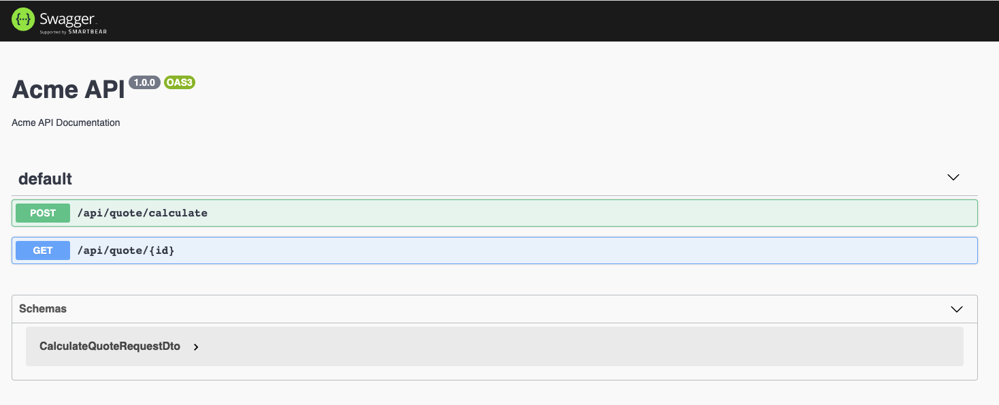
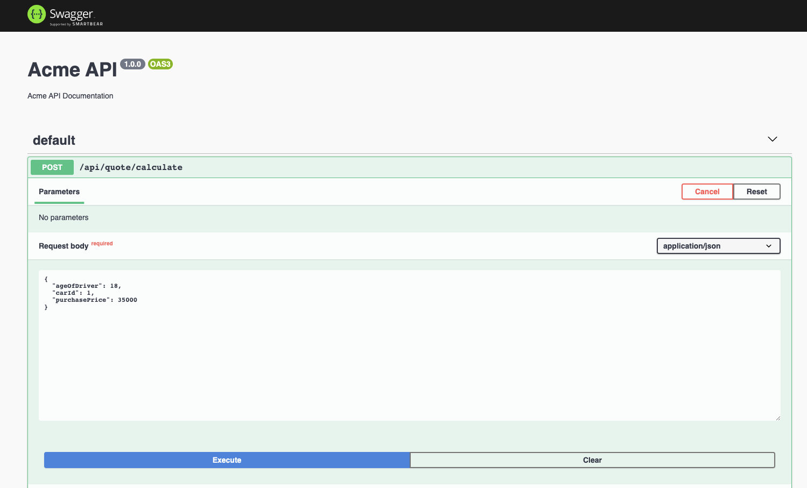
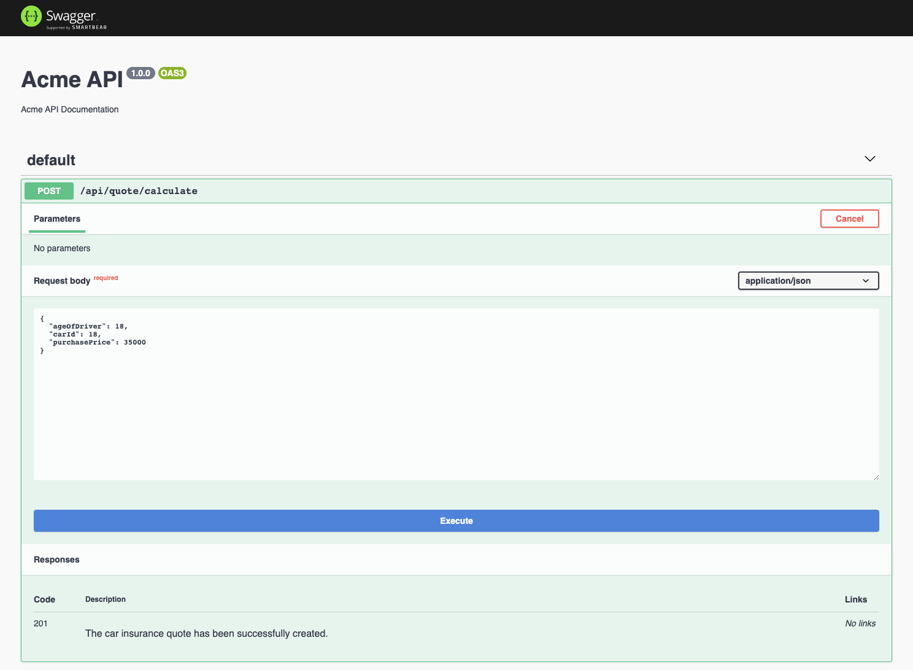
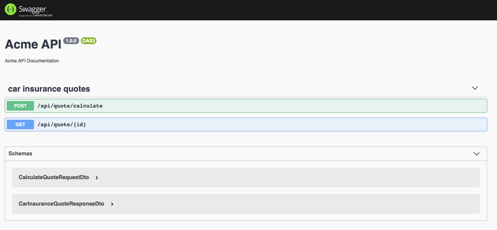

# OpenAPI Specification

## Setting up Swagger

Up until now, we've used `cURL` to send requests to our back-end API. It's a little bit cumbersome to compose the requests this way. Let's make life a bit easier.

The [OpenAPI Specification (OAS)](https://swagger.io/specification) is a standard, language-agnostic interface to RESTful APIs which allows both humans and computers to discover and understand the capabilities of the service without access to the source code, documentation, or through network inspection. When properly defined, a consumer can understand and interact with the remote service with a minimal amount of implementation logic.

Let's start with installing the required dependencies.

```sh
yarn add @nestjs/swagger swagger-ui-express
```

If you use `Fastify` instead of `ExpressJS` then install the following packages.

```sh
yarn add @nestjs/swagger fastify-swagger
```

Time to initialize Swagger. Open the `main.ts` file and configure the `SwaggerModule` as follows:

```ts
import { ValidationPipe } from '@nestjs/common';
import { NestFactory } from '@nestjs/core';
import { DocumentBuilder, SwaggerModule } from '@nestjs/swagger';
import { AppModule } from './app.module';

const GLOBAL_PREFIX = 'api';

async function bootstrap() {
  const app = await NestFactory.create(AppModule);
  app.setGlobalPrefix(GLOBAL_PREFIX);
  app.useGlobalPipes(new ValidationPipe());

  const config = new DocumentBuilder()
    .setTitle('Acme API')
    .setDescription('Acme API Documentation')
    .setVersion('1.0.0')
    .build();
  const document = SwaggerModule.createDocument(app, config);
  SwaggerModule.setup(GLOBAL_PREFIX, app, document);

  await app.listen(3000);
}
bootstrap();
```

Start the application, open a browser and navigate to `http://localhost:3000/api`.



The `document` instance created by `SwaggerModule.createDocument()`is a serializable object conforming to the [OpenAPI Document](https://swagger.io/specification/#openapi-document). You can also save it as a `JSON`/`YAML` file, instead of hosting it via HTTP via the `SwaggerModule`.

In order to get the JSON version just navigate to `http://localhost:3000/api-json`.

```json
{
  openapi: '3.0.0',
  info: {
    title: 'Acme API',
    description: 'Acme API Documentation',
    version: '1.0.0',
    contact: {}
  },
  tags: [],
  servers: [],
  components: { schemas: { CalculateQuoteRequestDto: [...] } },
  paths: {
    '/api/quote/calculate': { post: [...] },
    '/api/quote/{id}': { get: [...] }
  }
}
```

We can now execute requests to our back-end API via the Swagger UI. Let's try it out. Expand the `POST /api/quote/calculate` node and paste the following JSON into the request body and click `Execute`.

```json
{
  "ageOfDriver": 18,
  "carId": 1,
  "purchasePrice": 35000
}
```



## Decorating Controller Methods

The `SwaggerModule` from the `@nestjs/swagger` package searches for all `@Body()`, `@Query()`...etc. decorators in route handlers to generate the API document. It also creates model definitions by taking advantage of reflection.

In OpenAPI parlance, paths are endpoints (resources), such as `/customers` or `/products`, that your API exposes and operations are the HTTP verbs (`GET`, `POST`, `PUT`...) used to manipulate these resources.

The `@nestjs/swagger` module provides us with a couple of decorators that we can use to decorate our route handlers with additional metadata that is used to generate the OpenAPI document. This way we can provide more information and tweak the document. Let's decorate the route handlers for the quote controller.

```ts
import { Body, Controller, Get, Param, ParseIntPipe, Post } from '@nestjs/common';
import { ApiCreatedResponse, ApiOkResponse } from '@nestjs/swagger';
import { CalculateQuoteRequestDto, CarInsuranceQuoteResponseDto } from './dtos';

@Controller('quote')
export class QuoteController {
  @ApiCreatedResponse({
    description: 'The car insurance quote has been successfully created.',
    type: CarInsuranceQuoteResponseDto,
  })
  @Post('calculate')
  public async post(
    @Body() quote: CalculateQuoteRequestDto
  ): Promise<CarInsuranceQuoteResponseDto> {
    ...
  }

  @ApiOkResponse({
    description: 'A car insurance quote.',
    type: CarInsuranceQuoteResponseDto,
  })
  @Get(':id')
  public async getById(
    @Param('id', ParseIntPipe) id: number,
  ): Promise<CarInsuranceQuoteResponseDto> {
    ...
  }
}
```

Using decorators such as `@ApiCreatedResponse()` and `@ApiOkResponse()` we can provide extra metadata for the OpenAPI document generation. The `@nestjs/swagger` package provides many more decorators to help you tweak the document generation.

- `@ApiOkResponse()`
- `@ApiCreatedResponse()`
- `@ApiAcceptedResponse()`
- `@ApiNoContentResponse()`
- `@ApiMovedPermanentlyResponse()`
- `@ApiBadRequestResponse()`
- `@ApiUnauthorizedResponse()`
- ...and many more.

## Decorating DTO Properties

Not only can we decorate the route handlers, but we can also decorate the DTOs that contain the request payloads or the responses the API sends back.

Let's decorate the DTO used to contain the payload for calculating a car insurance quote.

```ts
import { ApiProperty } from '@nestjs/swagger';
import { IsNumber } from 'class-validator';

export class CalculateQuoteRequestDto {
  @ApiProperty({
    type: Number,
    description: 'The age of the driver. Minimum 18 years.',
    example: 18,
  })
  @IsNumber()
  ageOfDriver: number;

  @ApiProperty({
    type: Number,
    description: 'The ID of the car brand',
    example: 1,
  })
  @IsNumber()
  carId: number;

  @ApiProperty({
    type: Number,
    description: 'The purchase price of the car.',
    example: 35000,
  })
  @IsNumber()
  purchasePrice: number;
}
```

Using the `@ApiProperty()` decorator imported from the `@nestjs/swagger` package we can provide extra metadata for the properties of our DTOs. This metadata will be consumed when generating the OpenAPI document. This makes it easier for consumers of our API.

Let's also decorate the response DTO which contains the monthly and yearly premiums for a car insurance quote.

```ts
import { ApiProperty } from '@nestjs/swagger';

export class CarInsuranceQuoteResponseDto {
  @ApiProperty({
    type: Number,
    description: 'The ID of the car insurance quote',
    example: 1,
  })
  id: number;

  @ApiProperty({
    type: Number,
    description: 'The monthly price of the car insurance premium.',
    example: 35000,
  })
  monthlyPremium: number;

  @ApiProperty({
    type: Number,
    description: 'The yearly price of the car insurance premium',
    example: 35000,
  })
  yearlyPremium: number;
}
```

Using the metadata we provided via the decorators the `SwaggerModule` can generate a document supplying example data for our requests. This makes it very easy to call our endpoints via the Swagger UI to test them.



## Grouping Resources with Tags

Last, but not least we can also group resources with tags. For example, if you want to group multiple controllers under one tag you can do so by applying the `ApiTags()` decorator to the controllers.

```ts
import { Controller } from '@nestjs/common';
import { ApiTags } from '@nestjs/swagger';

@ApiTags('car insurance quotes')
@Controller('quote')
export class QuoteController {
  ...
}
```


