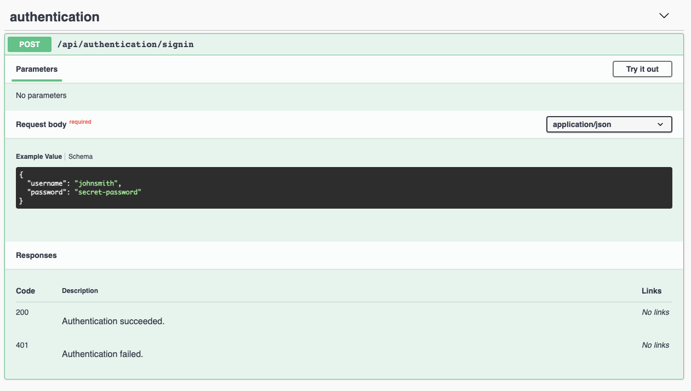
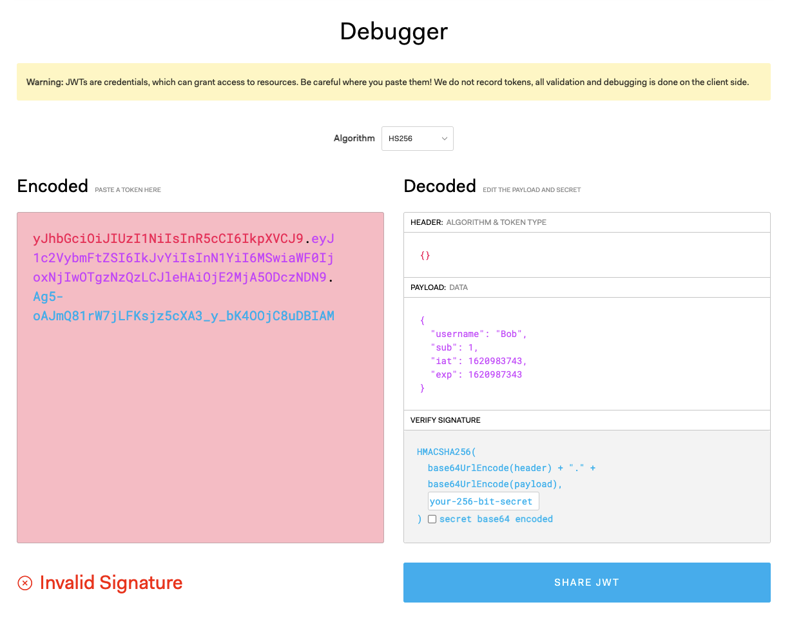
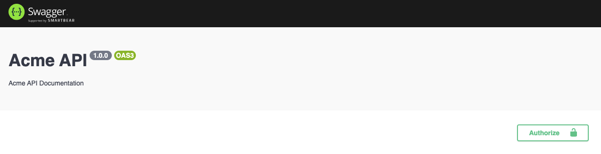
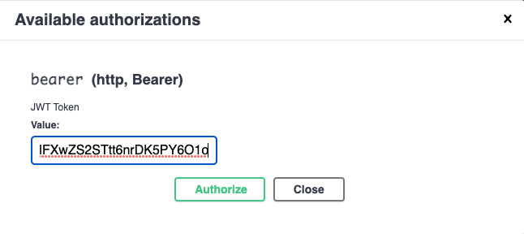

# Authentication

## Passport

One of the requirements is that only authenticated users should be able to calculate and retrieve car insurance quotes. Right now everybody can calculate quotes and retrieve them. We need to protect the following endpoints:

- `POST /api/quote/calculate`: endpoint to calculate a car insurance quote
- `GET /api/quote/:id`: endpoint to retrieve a car insurance quote

A user should first authenticate by providing their credentials such as a username and password. When these credentials are verified they'll receive a [JSON Web Token](https://jwt.io/) (JWT). Once authenticated, the JWT can be sent as a bearer token in the authorization header. We'll make sure the route handlers are protected and can only be called if the request includes a valid JWT.

To handle the authentication we'll use [Passport](https://github.com/jaredhanson/passport). Using the `@nestjs/passport` package it is easy to integrate into a NestJS application. Passport is `ExpressJS`-compatible authentication middleware for `Node.js`. Its sole purpose is to authenticate requests, which it does through an extensible set of plugins knows as `strategies`. You simply provide Passport a request to authenticate and it provides hooks for controlling what occurs when authentication succeeds or fails.

Passport uses strategies to authenticate requests. A strategy can be used to verify username and password credentials, delegate authentication using [OAuth](https://oauth.net/) (e.g. [IdentityServer](https://identityserver4.readthedocs.io/en/latest). validating JSON Web Tokens (JWT)...etc. You can write your own or you can use one of the [strategies](https://www.passportjs.org/packages/) provided by Passport.

In our case, we need to implement two strategies, one to validate the user's credentials (username/password) and another to validate a JWT token that is passed along in a request as a bearer token in the authorization header.

Passport abstracts the steps to perform authentication and the `@nestjs/passport` module wraps this into a NestJS module that we can use.

## Local Passport Strategy

Let's start by validating a user's credentials. Passport provides the [passport-local](https://www.passportjs.org/packages/passport-local/) strategy for authenticating with a username and password. The `passport-local` package lets you authenticate a username and password in your `Node.js` applications.

No matter which strategy we use we'll always need to install the [Passport](https://github.com/jaredhanson/passport) and [@nestjs\passport](https://github.com/nestjs/passport) packages.

```sh
yarn add passport @nestjs/passport
```

Optionally you can also install the type declarations for the `passport` package. All official NestJS packages are written in TypeScript and already come with type declarations.

```sh
yarn add @types/passport -D
```

Let's now install the `passport-local` package and its type declarations.

```sh
yarn add passport-local
yarn add @types/passport-local -D
```

Time to implement our local strategy. Start by adding a new `authentication` module and adding a service called `authentication` to it.

```sh
nest g mo authentication
nest g s authentication --no-spec
```

The authentication service is responsible for retrieving the user's information and validating the password. We need some place to store our user data. To keep things simple for now, let's hardcode the users. Add a new service to the authentication module which contains a list of hardcoded users.

```sh
nest g s users authentication --no-spec --flat
```

The implementation of the `UsersService` is simple. We just hardcode a list of users and provide one public method (`findByUsername`) to find a user by username. The user data is typed through the `User` interface.

```ts
import { Injectable } from '@nestjs/common';

export interface User {
  id: number;
  username: string;
  password: string;
}

@Injectable()
export class UsersService {
  private readonly users: User[] = [
    { id: 1, username: 'Bob', password: 'abc123' },
    { id: 2, username: 'Alice', password: 'def456' },
  ];

  public async findByUsername(username: string): Promise<User | undefined> {
    return this.users.find((user) => user.username === username);
  }
}
```

Now we are ready to implement our `AuthenticationService` we generated earlier. With the use of NestJS's dependency injection system, we inject the `UserService` through its constructor. We then provide a `validate(username, password)` method to validate a user's credentials. If a user could be found and the passwords match, then an `AuthenticatedUser` object is returned, otherwise `null`.

```ts
import { Injectable } from '@nestjs/common';
import { User, UsersService } from './users.service';

export type AuthenticatedUser = Omit<User, 'password'>;

@Injectable()
export class AuthenticationService {
  constructor(private readonly usersService: UsersService) {}

  public async validate(
    username: string,
    password: string
  ): Promise<AuthenticatedUser | null> {
    const user: User = await this.usersService.findByUsername(username);
    if (user?.password === password) {
      // Strip the password from the user object by destructuring it and spreading the other
      // properties into the authenticatedUser object.
      // eslint-disable-next-line @typescript-eslint/no-unused-vars
      const { password, ...authenticatedUser } = user;
      return authenticatedUser;
    }

    return null;
  }
}
```

**Remark**: In reality you do **not** want to hardcode your users. You store them in a database and you never store the clear text password. At a minimum, you hash the password using a salt. You only store this one-way hash. You then hash the submitted password using the user's salt and compare the hashes. Even better would be to not even roll your own authentication, but to use an [identity server](https://github.com/IdentityServer) that manages identities for you and handles authentication. There are many caveats involved in writing your own authentication.

Now we can finally implement a local strategy to validate a user's credentials. The `@nestjs/passport` package provides a `PassportStrategy` class that we can extend for this purpose. Add a new file called `local.strategy.ts` to the authentication module. Add the following code to it.

```ts
import { Injectable, UnauthorizedException } from '@nestjs/common';
import { PassportStrategy } from '@nestjs/passport';
import { Strategy } from 'passport-local';
import {
  AuthenticationService,
  AuthenticatedUser,
} from './authentication.service';

@Injectable()
export class LocalStrategy extends PassportStrategy(Strategy) {
  constructor(private readonly authenticationService: AuthenticationService) {
    super();
  }

  public async validate(
    username: string,
    password: string
  ): Promise<AuthenticatedUser> {
    const user: AuthenticatedUser | null =
      await this.authenticationService.validate(username, password);
    if (!user) {
      throw new UnauthorizedException();
    }

    return user;
  }
}
```

The `LocalStrategy` class extends from the `PassportStrategy` class imported from the `@nestjs/passport` package. We need to pass it the Passport strategy we'll be using. In this case, we are importing a strategy from the `passport-local` package.

We only need to implement the `validate(username, passport)` method. It uses the `AuthenticationService`, which was injected via constructor injection to validate a user's credentials. If valid it will return an `AuthenticatedUser` instance, otherwise it will throw a `UnauthorizedException` which NestJS will catch and translate into `401 Unauthorized` response.

The `passport-local` strategy by default expects properties called `username` and `passport` in the request's body. You can customize this if you want, by passing an options object to the `super()` invocation. For more information consult the [Passport local strategy's documentation](https://github.com/jaredhanson/passport-local).

Now that the local strategy is ready we must register it as a provider in the authentication module.

```ts
import { Module } from '@nestjs/common';
import { AuthenticationService } from './authentication.service';
import { LocalStrategy } from './local.strategy';
import { UsersService } from './users.service';

@Module({
  providers: [AuthenticationService, UsersService, LocalStrategy],
})
export class AuthenticationModule {}
```

Last, but not least, we must provide an endpoint via which users can sign in. Let's add an authentication controller for this purpose.

```sh
nest g co authentication authentication --flat --no-spec
```

Implementing the authentication controller is straightforward. First, let's add a DTO which we can bind to the request's body which contains the user's username and password. Create a new folder `dtos` within the authentication module and add a file called `signin-request.dto.ts` to it. Add the following code to it.

```ts
import { ApiProperty } from '@nestjs/swagger';

export class SignInRequestDto {
  @ApiProperty({
    type: String,
    description: "The user's username.",
    example: 'johnsmith',
  })
  username: string;

  @ApiProperty({
    type: String,
    description: "The user's password.",
    example: 'secret-password',
  })
  password: string;
}
```

Then add the following code to the `authentication.controller.ts` file.

```ts
import { Controller, Post, UseGuards, Request, Body } from '@nestjs/common';
import { AuthGuard } from '@nestjs/passport';
import {
  ApiOkResponse,
  ApiTags,
  ApiUnauthorizedResponse,
} from '@nestjs/swagger';
import { SignInRequestDto } from './dtos/signin-request.dto';

@ApiTags('authentication')
@Controller('authentication')
export class AuthenticationController {
  @ApiOkResponse({ description: 'Authentication succeeded.' })
  @ApiUnauthorizedResponse({ description: 'Authentication failed.' })
  @UseGuards(AuthGuard('local'))
  @Post('signin')
  public async signin(
    @Body() dto: SignInRequestDto,
    @Request() req
  ): Promise<void> {
    // On successfull authentication Passport makes the authenticated user (AuthenticatedUser)
    // available as a property on the request. We can obtain this using the @Request() decorator.
    console.log(req.user);
  }
}
```

By decorating the route handler with the `@UseGuards` decorator from the `@nestjs/common` package we are instructing it to use the local passport strategy to validate the user's credentials. The `signin` method itself doesn't require an implementation. The strategy takes care of everything. The `@Body()` decorator, `SignInRequestDto`, `@ApiOkResponse()`...decorators are only used to generate the OpenAPI document. This way we can also test the authentication via the Swagger UI.

Start the application, open a browser and navigate to `http://localhost:3000/api`. You'll notice that you can now sign in as a user via the Swagger UI.



Click `Try it out` and play around with it. If authentication fails a `401 Unauthorized` response will be returned, otherwise, a `201 Created` response. Use one of our hardcoded users to sign in.

## JSON Web Token

We can now validate a user's credentials, but we do not want to pass the username and password for every request. We want to do this once, issue a JSON Web Token (JWT), and then use this token in subsequent requests to authenticate the user by passing the token as a bearer token in the authorization header. When we validate a user's credentials we want to return a JWT token in the response. Let's update our code.

NestJS provides the `@nestjs/jwt` package that contains utilities based on the [jsonwebtoken](https://github.com/auth0/node-jsonwebtoken) package. Let's install it.

```sh
yarn add @nestjs/jwt
```

We need to register and configure the `JwtModule`, but before we do this, let's transform the `AuthenticationModule` into a dynamic module. With static module binding (`@Module()` decorator) you cannot customize the module's behavior. Suppose we want to pass some configuration when importing a module to customize it. That's where dynamic modules come into play. It's very simple, instead of passing the module's metadata via the `@Module()` decorator we provide a static method on the module that returns a `DynamicModule` instance. The properties of this instance are identical to the metadata passed to the `@Module()` decorator, but now we can pass an options object to the static function to tweak the module's behavior. Let's take a look at our refactored `AuthenticationModule`.

```ts
import { DynamicModule, Module } from '@nestjs/common';
import { AuthenticationService } from './authentication.service';
import { LocalStrategy } from './local.strategy';
import { UsersService } from './users.service';
import { AuthenticationController } from './authentication.controller';
import { JwtModule } from '@nestjs/jwt';

export interface AuthenticationModuleOptions {
  jwtSecret: string;
  expiresIn?: string;
}

@Module({})
export class AuthenticationModule {
  public static register(options: AuthenticationModuleOptions): DynamicModule {
    return {
      module: AuthenticationModule,
      providers: [AuthenticationService, UsersService, LocalStrategy],
      controllers: [AuthenticationController],
      imports: [
        JwtModule.register({
          secret: options.jwtSecret,
          signOptions: {
            expiresIn: options.expiresIn || '1h', // default to 1 hour
          },
        }),
      ],
    };
  }
}
```

We removed the metadata from the `@Module()` decorator and added a static `register()` function to the `AuthenticationModule`. This function takes an `AuthenticationModuleOptions` instance which contains properties such as `jwtSecret`, `expiresIn`...etc. We can use the passed in options to configure the `DynamicModule` returned by the `register()` method. Here you see that we use the options to configure the `JwtModule` module that we import. Notice that the `JwtModule` is also a dynamic module that offers a static `register()` function where we can pass in the options to configure it.

```ts
export declare class JwtModule {
    static register(options: JwtModuleOptions): DynamicModule;
    ...
}
```

Now that we have refactored the `AuthenticationModule` we must fix the import in our application's root module (`app.module.ts`).

```ts
@Module({
  imports: [
    CarInsuranceQuoteModule,
    // TODO: Retrieve these values from environment variables.
    AuthenticationModule.register({
      jwtSecret: 'my-secret-key',
      expiresIn: '1h',
    }),
  ],
  controllers: [],
  providers: [],
})
export class AppModule {}
```

**Remark**: To keep things simple we hardcoded the secret used to sign JWT tokens and their expiration time. When deploying to production retrieve these values from your environment (environment variables) instead. Always retrieve them in your application's root module and from there pass them down to the imported modules. Never read the environment variables from within other modules as that makes it hard to track down how the application is configured.

We are now ready to generate a JWT token. Open the authentication service file (`authentication.service.ts`) and add a new method called `signin()` to the `AuthenticationService`.

```ts
import { JwtService } from '@nestjs/jwt';

@Injectable()
export class AuthenticationService {
  constructor(
    private readonly usersService: UsersService,
    private readonly jwtService: JwtService,
  ) {}

  ...

  public signin(user: AuthenticatedUser): string {
    const payload = { username: user.username, sub: user.id };
    return this.jwtService.sign(payload);
  }
}
```

The `signin()` method takes an `AuthenticatedUser` instance and uses the `JwtService` injected via the constructor to create a JWT token. The `JwtService` from the `@nestjs/jwt` package uses the `jsonwebtoken` module internally.

Now we can use this new `signin()` method in the `AuthenticationController`, but before we do this let's first add a new DTO called `signin-response.dto.ts` to the authentication module's dtos folder.

```ts
import { ApiProperty } from '@nestjs/swagger';

export class SignInResponseDto {
  @ApiProperty({
    type: String,
    description: 'Jason Web Token (JWT) for an authenticated user.',
    example: 'eyJhbGci...',
  })
  accessToken: string;
}
```

Now inject the `AuthenticationService` into the `AuthenticationController` and call its `signin()` method once the local Passport strategy validated the user's credentials and provided us with an `AuthenticatedUser` instance.

```ts
...
import { AuthenticationService } from './authentication.service';
import { SignInRequestDto } from './dtos/signin-request.dto';
import { SignInResponseDto } from './dtos/signin-response.dto';

@Controller('authentication')
export class AuthenticationController {
  constructor(private readonly authenticationService: AuthenticationService) {}

  @ApiOkResponse({ description: 'Authentication succeeded.' })
  @ApiUnauthorizedResponse({ description: 'Authentication failed.' })
  @UseGuards(AuthGuard('local'))
  @Post('signin')
  public async signin(
    @Body() dto: SignInRequestDto,
    @Request() req
  ): Promise<SignInResponseDto> {
    return {
      accessToken: this.authenticationService.signin(req.user),
    };
  }
}
```

Restart the application and refresh Swagger UI in your browser. Now sign in using one of our hardcoded users. The response will now include an object with an `accessToken` property that contains a JWT token.

```json
{
  "accessToken": "eyJhbGci..."
}
```

You can navigate to `http://jwt.io` and paste the JWT token there to view its contents.



## JWT Passport Strategy

Now everything is in place to protect the car insurance quote endpoints.

- `POST /api/quote/calculate`: endpoint to calculate a car insurance quote
- `GET /api/quote/:id`: endpoint to retrieve a car insurance quote

When these two endpoints are called users must first sign in and then provide the obtained JWT token as a bearer token in the authorization header. But to validate the incoming tokens we must implement another strategy. This time the Passport strategy will not validate a username and password, but rather a JWT token. Luckily Passport also provides a strategy for this, namely the [passport-jwt](https://www.passportjs.org/packages/passport-jwt/) strategy.

Install the package and its type declarations.

```sh
yarn add passport-jwt
yarn add @types/passport-jwt -D
```

Add a file called `jwt.strategy.ts` to the authentication module. Like the local strategy, the `JwtStrategy` extends from `PassportStrategy` and specifies the strategy it uses. This time we do pass some custom configuration to the Passport strategy. We must tell it the secret that was used to sign the tokens so that it can validate the incoming tokens. We also tell the Passport strategy where it can find the JWT token in the request. In our case, it will be extracted from the authorization header. The configuration is injected via the constructor and the Passport configuration to the `super()` invocation.

When the token is validated, the `validate()` method is called and the payload of the token is passed to it. We take this data and convert it back into an `AuthenticatedUser` instance. Voila, we have now authenticated our user via a JWT token.

```ts
import { ExtractJwt, Strategy } from 'passport-jwt';
import { Injectable } from '@nestjs/common';
import { PassportStrategy } from '@nestjs/passport';
import { AuthenticatedUser } from './authentication.service';

interface JwtPayload {
  sub: string;
  username: string;
}

export class JwtStrategyConfiguration {
  jwtSecret: string;
}

@Injectable()
export class JwtStrategy extends PassportStrategy(Strategy) {
  constructor(configuration: JwtStrategyConfiguration) {
    super({
      jwtFromRequest: ExtractJwt.fromAuthHeaderAsBearerToken(),
      ignoreExpiration: false,
      secretOrKey: configuration.jwtSecret,
    });
  }

  public async validate(payload: JwtPayload): Promise<AuthenticatedUser> {
    return {
      id: parseInt(payload.sub, 10),
      username: payload.username,
    };
  }
}
```

Now we need to register the new strategy as a provider in the authentication module.

```ts
...
import { JwtStrategy, JwtStrategyConfiguration } from './jwt.strategy';

@Module({})
export class AuthenticationModule {
  public static register(options: AuthenticationModuleOptions): DynamicModule {
    return {
      module: AuthenticationModule,
      providers: [
        ...
        LocalStrategy,
        {
          provide: JwtStrategyConfiguration,
          useValue: {
            jwtSecret: options.jwtSecret,
          },
        },
        JwtStrategy,
      ],
      controllers: [...],
      imports: [...]
    };
  }
}
```

Note the registration of the `JwtStrategyConfiguration` provider. It is necessary since it is a dependency of the `JwtStrategy`. The JWT configuration is passed down from the main application module (`app.module.ts`) to the authentication module and eventually injected into the `JwStrategy`.

## Guards

Finally, everything is in place to secure our route handlers. To do this we can use guards. Guards have a single responsibility. They determine whether a given request will be handled by the route handler or not. Guards implement the `CanActivate` interface. A guard returns a boolean indicating if the route handler can be called depending on a condition.

```ts
@Injectable()
export class AuthGuard implements CanActivate {
  canActivate(
    context: ExecutionContext,
  ): boolean | Promise<boolean> | Observable<boolean> {
    ...
  }
}
```

The `@nestjs/passport` provides us with the `AuthGuard` which allows us to secure a route handler with a passport strategy. We can apply this guard via the `@UseGuards()` decorator. You can apply this decorator to a controller (class) or a route handler (method). Let's apply it to the `QuoteController`, this way all route handlers declared in this controller are secured.

```ts
import { UseGuards,... } from '@nestjs/common';
import { AuthGuard } from '@nestjs/passport';

@ApiTags('car insurance quotes')
@Controller('quote')
@UseGuards(AuthGuard('jwt'))
export class QuoteController {
  ...
}
```

If you now restart the application and navigate to the Swagger UI, you will get a `401 Unauthorized` response when you call one of the car insurance endpoints.

## Swagger UI

We can obtain a JWT token via the Swagger UI, but we don't have a way yet to specify which JWT token should be sent along with every request as a bearer token in the authorization header. Let's fix this.

Open the `main.ts` file and add the `addBearerAuth(...)` line to the `DocumentBuilder` configuration.

```ts
const config = new DocumentBuilder()
  .setTitle('Acme API')
  .setDescription('Acme API Documentation')
  .setVersion('1.0.0')
  .addBearerAuth({ description: 'JWT Token', type: 'http' })
  .build();
```

Then go back to the `QuoteController` and apply the `@ApiBearerAuth()` decorator to it. This way the Swagger UI knows that it must include the bearer token for the route handlers in this controller.

```ts
import { ApiBearerAuth,...} from '@nestjs/swagger';

@ApiBearerAuth()
export class QuoteController { ... }
```

If you refresh the Swagger UI you'll notice a new `Authorize` button in the top right-hand corner.



If you click on this button you can fill in the JWT token that will be sent along with every request made via the Swagger UI. First, obtain a token by signing in a user and then copy/paste the obtain token. Afterward, you can call the secured car insurance quote endpoints again.


