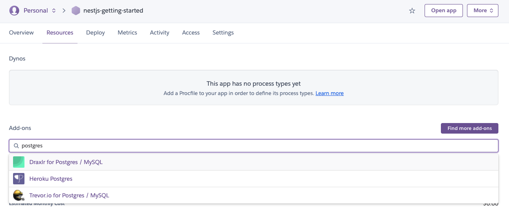
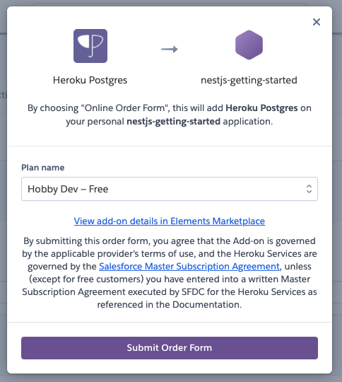
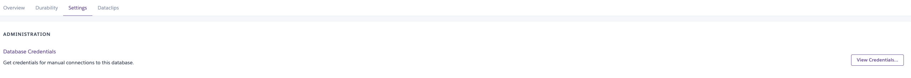
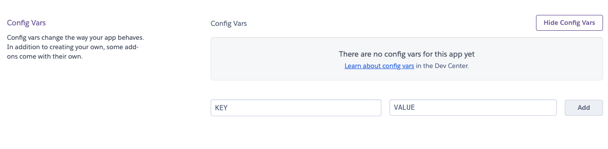
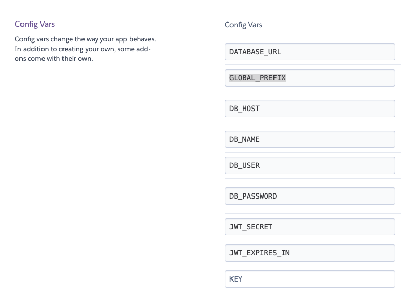
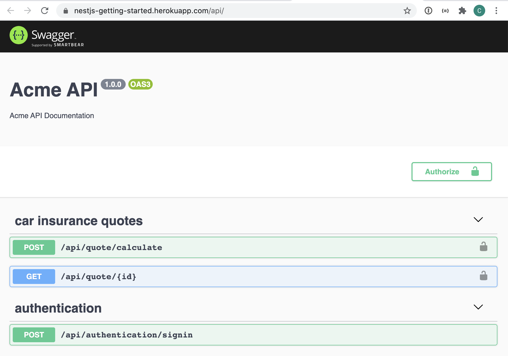

# Bonus: Deploying to Heroku

## Prerequisites

For this chapter you'll need a Heroku account. If you don't have one yet sign up here:

https://signup.heroku.com/login

You also need to install the Heroku CLI. Download the installation package for your OS.

* [Windows - 64 bit installer](https://cli-assets.heroku.com/heroku-x64.exe)
* [Windows - 32 bit installer](https://cli-assets.heroku.com/heroku-x86.exe)

On `macOS` you can use [Homebrew](https://brew.sh/) to install the CLI.

```sh
brew tap heroku/brew && brew install heroku
```

On `Ubuntu16+` or other Linux OS's use [snap](https://snapcraft.io).

```sh
sudo snap install --classic heroku
```

The CLI is built with `Node.js` and is also installable via `NPM`. Only use this method for environments where autoupdating is not wanted or where Heroku does not offer a prebuilt binary.

```sh
npm i -g heroku
```

For other installation methods please consult the [documentation](https://devcenter.heroku.com/articles/heroku-cli#download-and-install).

Let's verify if the installation worked.

```sh
heroku --version
heroku/7.53.0 darwin-x64 node-v12.21.0
```

You should see `heroku/major.minor.path` in the output.

## Environment Variables

There are some places in the code where we hardcoded certain values such as the database name, secret to sign JWT tokens, global prefix for every HTTP route path...etc. We need to replace these hardcoded values with environment variables that we can configure on the hosting environment. 

In total we can identify 8 such variables.

| Name           | Description                           | Type    | Default value |
| -------------- | ------------------------------------- | ------- | ------------- |
| PORT           | port on which the HTTP server listens | number  | `3000`        |
| GLOBAL_PREFIX  | prefix for every HTTP route path.     | string  | `api`         |
| DB_HOST        | PostgreSQL Database Host              | string  | /             |
| DB_USER        | PostgreSQL Database User              | string  | /             |
| DB_PASSWORD    | PostgreSQL Database Password          | string  | /             |
| DB_NAME        | PostgreSQL Database Name              | string  | /             |
| JWT_SECRET     | Secret used to sign JWT tokens        | string  | /             |
| JWT_EXPIRES_IN | Expiration time of the JWT tokens. Expressed in seconds or a string describing a time span zeit/ms. Eg: 60, "2 days", "10h", "7d"  | string  | `1h` |

These hardcoded values are either located in the application's main entry file (`main.ts`) or in the root module (`app.module.ts`).

To read the environment variables we'll be using a package called [getenv](https://github.com/ctavan/node-getenv).

```sh
yarn add getenv
yard add @types/getenv -D
```

This package offers utility functions to get and typecast environment variables. Useful if you are building [Twelve-Factor Apps](https://www.12factor.net) where the configuration is stored in the environment.

Start by updating the main entry file (`main.ts`). Import `getenv` and use the `getenv.string()` function to read the value for the `GLOBAL_PREFIX` environment variable from the environment. The second optional argument is a fallback value that will be used in case the environment variable is not set.

There's a special environment variable that deserves some special mention, namely `PORT`. Heroku expects a web application to bind its HTTP server to the port defined by the `PORT` environment variable. Our application currently uses the hardcoded port `3000`. We need to use the value of the `PORT` environment variable that Heroku automatically provides for us. Use `getenv.int()` to read the `PORT` environment variable. For local development we fallback to port `3000`.

```ts
...
import * as getenv from 'getenv';

async function bootstrap() {
  const globalPrefix: string = getenv.string('GLOBAL_PREFIX', 'api');

  const app = await NestFactory.create(AppModule);
  app.setGlobalPrefix(globalPrefix);
  ...
  const document = SwaggerModule.createDocument(app, config);
  SwaggerModule.setup(globalPrefix, app, document);

  const port: number = getenv.int('PORT', 3000);
  await app.listen(port);
}
bootstrap();
```

Via `getenv.disableFallbacks()` you can disallow fallbacks in environments (e.g. `production`) where you don't want to rely on them. In our example application we'll allow fallbacks, but consider disabling them in real-world applications. It helps you identity environment variables which you forgot to configure.

```ts
if (process.env.NODE_ENV === 'production') {
  getenv.disableFallbacks();
}
```

Time to move on to the root module (`main.ts`). Again import `getenv` and use it to read the values from the environment. If this case, a fallback value is only configured for the `JWT_EXPIRES_IN` environment variable.

```ts
...
import * as getenv from 'getenv';

@Module({
  imports: [
    CarInsuranceQuoteModule,
    AuthenticationModule.register({
      jwtSecret: getenv.string('JWT_SECRET'),
      expiresIn: getenv.string('JWT_EXPIRES_IN', '1h'),
    }),
    KnexModule.forRootAsync({
      useFactory: () => ({
        config: {
          client: 'pg',
          connection: {
            host: getenv.string('DB_HOST'),
            user: getenv.string('DB_USER'),
            password: getenv.string('DB_PASSWORD'),
            database: getenv.string('DB_NAME'),
          },
        },
      }),
    }),
  ],
  providers: [...]
})
export class AppModule {}
```

The `getenv` package offers other methods such as `int`, `float`, `bool`...etc. if you want to cast an environment variable to a different type. Our environment values all happen to be strings.

If you start the application now you'll receive an error.

```sh
yarn start:dev
Error: GetEnv.Nonexistent: JWT_SECRET does not exist and no fallback value provided.
```

First you need to set the environment variables.

```sh
export JWT_SECRET=very-top-secret
export DB_HOST=localhost
export DB_USER=superuser_username_for_postgresql
export DB_PASSWORD=superuser_password_for_postgresql
export DB_NAME=acme
```

Now the application can read the variables from the environment and it will start up!

**Remark**: In [chapter 9](./09-add-postgresql-with-knex.md) we also used two environment variables, `POSTGRES_USER` and `POSTGRES_PASSWORD` in the `docker-compose.yml` file. You can leave them or you can replace them with the new `DB_USER` and `DB_PASSWORD` variables.

## The Procfile

Heroku applications typically include a `Procfile` that specifies the commands that are executed by the application on startup. Create a new file named `Procfile` in the root of the repository, to declare what command should be executed to start your application.

```
web: yarn start:prod
```

This declares a single process type, `web`, and the command needed to run it. The name `web` declares that this process will be attached to the [HTTP routing](https://devcenter.heroku.com/articles/http-routing) stack of Heroku, and will receive web traffic when deployed. The command uses the `start:prod` script specified in the application's manifest (`package.json`) to start the application.

Procfiles can contain additional process types. For example, you might declare one or more for background worker processes.

## Creating a Heroku Application

Before we can deploy we need to create an application on Heroku. You can do this via the Heroku web application or via the CLI. First you need to log in.

```sh
heroku login
```

This will open up a browser to allow you to log in. After logging in you can close the browser. To verify the Heroku account by which you are logged in execute:

```sh
heroku whoami
```

This will echo back the username of the Heroku account which is currently logged in. 

Now you can create an application. Via the `--region` flag you can specify a region, United States (`us`) or Europe (`eu`).

```sh
heroku create acme-api --region eu
```

If you prefer using the web application, then follow these steps:

1. Log in to [your account on Heroku](https://id.heroku.com/login).
2. Click the `New` button in the top right-hand corner.
3. Select `Create New App`.
4. Fill in a name for the application (e.g. `acme-api`, `nestjs-getting-started`...).
5. Select a region (`United States` or `Europe`).
6. Finally, click the `Create app` button.

After a few moments the application will be created and you'll be redirected to the application's dashboard.

## Setting up a PostgreSQL Database

Apart from the application itself we also need to create a PostgreSQL database. I find doing this is easier via the Heroku web application. Select the `Resources` tab and under `Add-ons` search for `postgres`.



Select the `Heroku Postgres` add-on and select the `Hobby Dev - Free` plan.



Now, submit the order form. After the `Heroku Postgres` add-on has been installed you can select it from the list of installed add-ons. You'll be redirected to a different site where you can manage your free PostgreSQL database. On this site navigate to the `Settings` tab and click the `View Credentials...` button under `Database Credentials`.



Take note of the host, database, user and password. You'll need them to configure the Heroku environment variables later. For now, you'll need them to connect to the database directly using a tool such as [DBeaver](https://dbeaver.io). Go ahead, start the tool, configure a new connection to the PostgreSQL database, and run the following SQL script to create the `car_insurance_quote` table.

```sql
CREATE TABLE IF NOT EXISTS car_insurance_quote (
   id serial PRIMARY KEY,
   ageOfDriver INT NOT NULL,
   monthlyPremium decimal(12,2) NOT NULL,
   yearlyPremium decimal(12,2) NOT NULL,
   createdOn TIMESTAMP NOT NULL
);
```

Last, but not least we need to modify the bit of code that creates the connection to the database. Open the root module file (`app.module.ts`) and modify the configuration passed to `KnexModule.forRootAsync()`. Take note of the new `ssl` options. The `pg` package used to establish the connection enables SSL validation by default. Heroku uses self-signed certificated, hence we need to turn this off or the connection will not succeed. For more information see the [Connecting in Node.js](https://devcenter.heroku.com/articles/heroku-postgresql#connecting-in-node-js) documentation on Heroku.

```ts
@Module({
  imports: [
    ...
    KnexModule.forRootAsync({
      useFactory: () => ({
        config: {
          client: 'pg',
          connection: {
            host: getenv.string('DB_HOST'),
            user: getenv.string('DB_USER'),
            password: getenv.string('DB_PASSWORD'),
            database: getenv.string('DB_NAME'),
            ssl: { rejectUnauthorized: false },
          },
        },
      }),
    }),
  ],
  providers: [...]
})
export class AppModule {}
```

## Application Environment

We're almost there. One last thing to do before we deploy. Remember those environment variables? Time to configure our Heroku application's environment. To configure these, go back to your Heroku application and select the `Settings` tab. Under `Config Vars` click the `Reveal Config Vars` button.



You'll notice that Heroku added a `DATABASE_URL` environment variable when you added the `Heroku Postgres` add-on. Ignore this environment variable. Now, add the environment variables listed above here.



## Deployment

Finally, we are ready to deploy our application. Under the `Settings` tab of your Heroku application copy the `Heroku GIT URL`. Add a new GIT remote to your local repository with the name `heroku`.

```sh
git remote add heroku https://git.heroku.com/nestjs-getting-started.git
```

You should now have two GIT remotes configured for your local repository, `origin` and `heroku`.

```sh
git remote ls
heroku
origin
```

All we need to do to deploy our application is to push the code to the GIT repository on Heroku. Before we do so make sure all the changes are committed. Afterward, push the `master` branch to the remote repository identified by the `heroku` alias. 

```sh
git push heroku master:master
```

Heroku will automatically install the dependencies, build the application, prune the development dependencies, inspect the `Procfile` and launch the application. The build output will list the application's URL when the deploy is done.

```sh
...
remote: -----> Build succeeded!
remote: -----> Discovering process types
remote:        Procfile declares types -> web
remote:
remote: -----> Compressing...
remote:        Done: 44.9M
remote: -----> Launching...
remote:        Released v21
remote:        https://nestjs-getting-started.herokuapp.com/ deployed to Heroku
```

Open the URL in your browser and append the global prefix `api` to it.



Yay, our application is now up and running on Heroku!