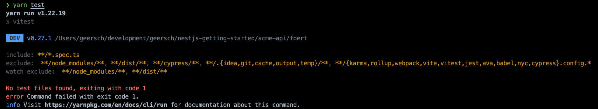
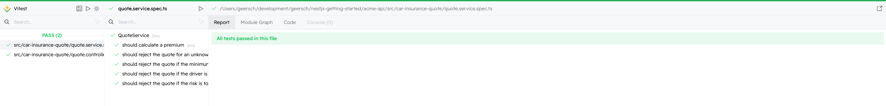
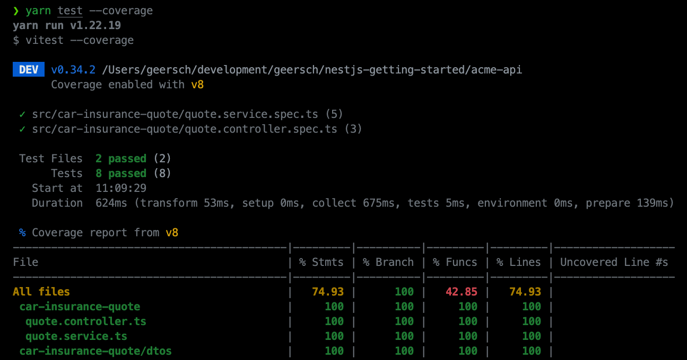
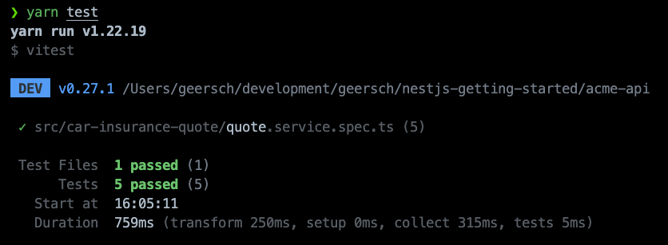
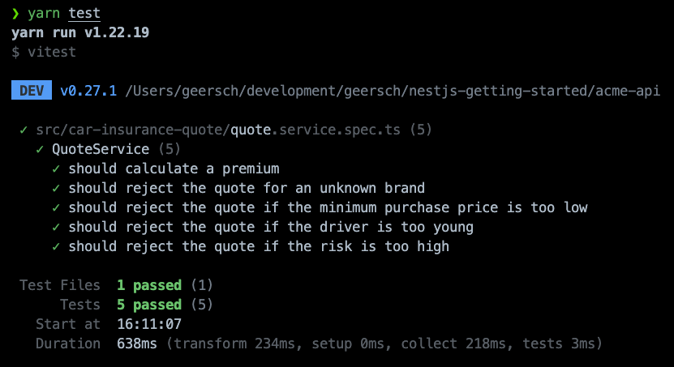
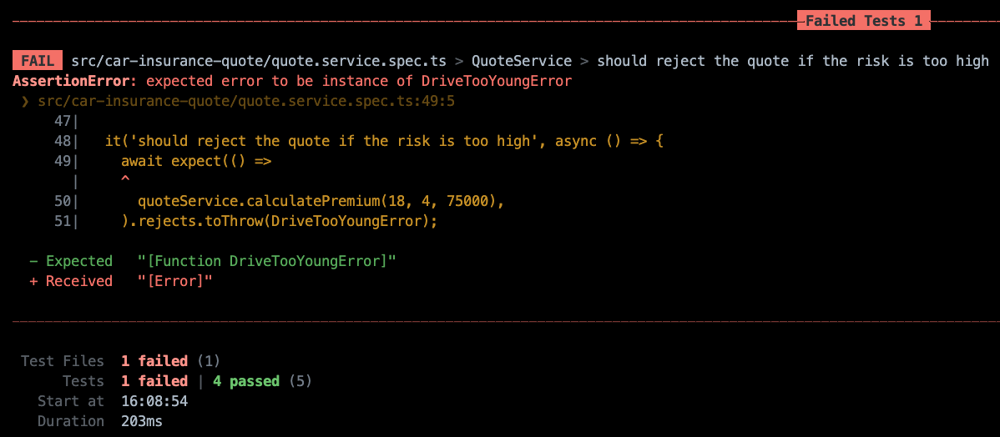

# Vitest

## Introducing Vitest

Vitest is a test framework that uses [Vite](https://vitejs.dev/) as a NodeJS runtime to run tests. Vite itself is a build tool to speed up development for modern web projects. It leverages new advancements in the JavaScript ecosystem such as ESM modules and provides a dev server which serves the source code over [native ESM](https://developer.mozilla.org/en-US/docs/Web/JavaScript/Guide/Modules). This lets the browser take over part of the job of a bundler. Vite only needs to transform and serve the requested source code.

Vitest relies on Vite which in turn uses [esbuild](https://esbuild.github.io/) to do the transpilation of TypeScript to JavaScript. It allows running JavaScript and TypeScript files on NodeJS using Vite's resolvers and transformers. It makes this possible via a package called [vite-node](https://github.com/vitest-dev/vitest/tree/main/packages/vite-node) which uses Vite as a NodeJS runtime. The Typescript code is transpiled into ESM modules (`ES6`) which Vitest then runs using `node-vite`. It handles the interoperability with CommonJS (CJS) modules. This allows you to use ESM features in your test files such as [top-level await](https://developer.mozilla.org/en-US/docs/Web/JavaScript/Reference/Operators/await#top_level_await). One caveat: know that the source code is tranpiled differently during testing versus the build output.

Why Vitest instead of Jest? In my opinion Vitest provides better isolation between test suites. Jest resets the [require cache](https://nodejs.org/api/modules.html#requirecache) between each test run isolating test suites from each other. A test suite can require and modify a module without it impacting another test suite. The other test suite gets its own separate copy.

There's a catch, Jest's ability to reset the require cache can only do so much. It cannot reset built-in NodeJS modules such as `fs`, `https`, `stream`...etc. If a third-party module monkey-patches a built-in module, that module cannot be reset and it will remain it memory. Anything references by that module also sticks around for the party. This is especially problematic if you run tests in band (`--runInBan`) as one process runs all the test suite sequentially and the memory usage of that process can grow quite large. You might even get the dreaded "JavaScript heap out of memory" error.

Diagnostic and analytical modules (e.g. [Application Insights](https://github.com/microsoft/ApplicationInsights-node.js)) or those that introduce async context tracking are the usual suspects, but any third-party module is free to monkey-patch a built-in module.

Vitest provides better isolation between test suites. It uses [workers](https://vitest.dev/config/#threads) not only for running test suites in parallel, but also to provide isolation. The memory usage of one test suite does not influence another.

## Removing Jest

When we started out we scaffolded our application using the Nest CLI.

```sh
nest new acme-api
```

By default it includes dependencies for the [Jest](https://jestjs.io/) testing framework and adds a unit and end-to-end test.

The initial project structure includes the following files.

```
.
├── src
│   ├── app.controller.spec.ts
│   ├── ...
│   └── main.ts
├── test
│   ├── app.e2e-spec.ts
│   └── jest-e2e.json
├── ...
└── package.json
```

Let's remove the following files, if they are still present in your repository.

- `app.controller.spec.ts`
- `app.e2e-spec.ts` (Jest configuration for end-to-end tests)
- `jest-e2e.json`

Apart from these files we also need to remove all of Jest's dependencies.

```sh
yarn remove @types/jest jest ts-jest
```

And update our test scripts.

Replace

```json
{
  ...
  "scripts": {
    ...
    "test": "jest",
    "test:watch": "jest --watch",
    "test:cov": "jest --coverage",
    "test:debug": "node --inspect-brk -r tsconfig-paths/register -r ts-node/register node_modules/.bin/jest --runInBand",
    "test:e2e": "jest --config ./test/jest-e2e.json"
  },
  ...
}
```

with

```json
{
  ...
  "scripts": {
    ...
    "test": "vitest",
    "test:e2e": "vitest --config vitest.config-e2e.ts",
  },
  ...
}
```

Doesn't that look a lot cleaner? Personally I don't like a lot of similar test scripts, one for each possible flag such as `--watch`, `--coverage`...etc. Just add them on the command-line, they will be passed along.

```sh
yarn test
yarn test --watch
yarn test --coverage
...
```

The last remaining thing is to remove the `jest` section from `package.json`. Go ahead and delete it. For Vitest we will add dedicated configuration files instead of embedding it in the application's manifest file.

## Adding Vitest

### Configuring Vitest

Now that everything's been cleaned up we can start with a clean slate. Let's add Vitest.

```sh
yarn add -D vitest
```

**Remark**: Vitest requires Vite `>= v3.0.0` and Node `>= v14.0`.

To configure Vitest add a `vite.config.ts` to the root of the repository. For projects that already use Vite this file already exists. Vitest configuration is unified with that of Vite. Everything is configured in the same file. In our setup, that's not the case so we have to configure it from scratch. Copy paste the following configuration to the file.

```ts
import { defineConfig } from 'vite';

export default defineConfig({
  plugins: [],
  test: {
    deps: {
      interopDefault: true,
    },
    environment: 'node',
    coverage: {
      reporter: ['text', 'html'],
    },
    reporters: 'default',
    include: ['**/*.spec.{ts,cts}'],
  },
  root: '.',
});
```

Using [defineConfig](https://vitejs.dev/config) imported from `vite` we add a `test` section that contains the configuration for Vitest. Here we configure the environment (`node`), the test report (`default`), the coverage reporters (`test`, `html`), the test files (`*.spec.ts`) to include and set `interopDefault` to `true` to make sure Vitest interpretes CommonJS (CJS) module's default export as a named export. For more in-depth documentation about all the possible configuration option, consult the [Vitest documentation](https://vitest.dev/guide/).

Voila, you are now ready to run tests using Vitest. Just use the `test` script we setup earlier.

```ts
yarn test
```

Of course, we don't have any tests yet, so you'll get the following error.



Don't worry, we'll soon add some tests.

### UI

Vite, which powers Vitest, also provides a development server which allows it to also serve up a UI to visualise your tests. It's an optional dependency, but if you are interested you can install it.

```sh
yarn add -D @vitest-ui
```

Just pass the `--ui` flag when runnig the test script.

```sh
yarn test --ui
```



### Coverage

Another optional dependency you can install is one to calculate the code coverage. Vitest supports native code coverage via [c8](https://github.com/bcoe/c8) and instrumented code coverage via [istanbul](https://istanbul.js.org/).

For `c8`:

```sh
yarn add -D @vitest/coverage-c8
```

Or for `istanbul`:

```sh
yarn add -D @vitest/coverage-istanbul
```

You can then generate coverage by passing the `--coverage` flag to the test script.

```sh
yarn test --coverage
```



## Unit Tests

### Mocks

Before we can add some unit tests we'll have to add some mock implementations for the car brand and quote repositories. We don't want the unit tests to talk to the database. Rather we want to stub out this dependency and control the data ourselves.

Create a `test` folder in the root of the repository and add a `mocks` folder to it. Next add a `mock-car-brand.repository.ts` and `mock-car-insurance-quote.repository.ts` file to the `mocks` folder and finally a barrel file (`index.ts`).

Your project structure should resemble this:

```
.
├── src
│   ├── ...
│   └── main.ts
├── test
│   └── mocks
│       ├── index.ts
│       ├── mock-car-brand.repository.ts
│       └── mock-car-insurance-quote.repository.ts
├── ...
└── package.json
```

Let's setup an in-memory list of car brands. Copy paste the below code into the `mock-car-brand.repository.ts` file.

```ts
import {
  CarBrand,
  CarBrandRepository,
} from '../../src/car-insurance-quote/repositories';

const BRANDS: CarBrand[] = [
  {
    id: 1,
    name: 'Mercedes',
    minimumDriverAge: 18,
    yearlyPremium: 1000,
  },
  { id: 2, name: 'BMW', minimumDriverAge: 18, yearlyPremium: 1250 },
  { id: 3, name: 'Audi', minimumDriverAge: 18, yearlyPremium: 1500 },
  {
    id: 4,
    name: 'Porsche',
    minimumDriverAge: 25,
    yearlyPremium: 2500,
  },
];

export class MockCarBrandRepository extends CarBrandRepository {
  public async findById(id: number): Promise<CarBrand | null> {
    const brand = BRANDS.find((car) => car.id === id);
    return brand ?? null;
  }
}
```

We'll also store the quotes created during the tests in-memory. Add the following code to the `mock-car-insurance-quote.repository.ts` file.

```ts
import {
  CarInsuranceQuote,
  CarInsuranceQuoteRepository,
} from '../../src/car-insurance-quote/repositories';

export class MockCarInsuranceQuoteRepository extends CarInsuranceQuoteRepository {
  private quotes: CarInsuranceQuote[] = [];

  public async save(
    ageOfDriver: number,
    monthlyPremium: number,
    yearlyPremium: number
  ): Promise<CarInsuranceQuote> {
    const quote = {
      id: this.quotes.length + 1,
      ageOfDriver,
      monthlyPremium,
      yearlyPremium,
      createdOn: new Date(),
    };
    this.quotes.push(quote);
    return quote;
  }

  public async load(id: number): Promise<CarInsuranceQuote | null> {
    const quote = this.quotes.find((quote) => quote.id === id);
    return quote ?? null;
  }
}
```

It's a simple, but for testing purposes it suffices.

Last, but not least let's export these mocks through the barrel file (`index.ts`) file.

```ts
export * from './mock-car-brand.repository';
export * from './mock-car-insurance-quote.repository';
```

### Tests

Let's start by adding some tests for the `QuoteService`. Add a `quote.service.spec.ts` file next to the `quote.service.ts` file. Copy paste the below code in it.

```ts
import { beforeEach, describe, expect, it } from 'vitest';
import { QuoteService } from './quote.service';
import {
  DriveTooYoungError,
  PurchasePriceTooLowError,
  RiskTooHighError,
  UnknownCarBrandError,
} from './errors';
import {
  MockCarBrandRepository,
  MockCarInsuranceQuoteRepository,
} from '../../test';

describe('QuoteService', () => {
  let quoteService: QuoteService;

  beforeEach(() => {
    quoteService = new QuoteService(
      new MockCarBrandRepository(),
      new MockCarInsuranceQuoteRepository()
    );
  });

  ...
});
```

As you can see we don't rely on NestJS's dependency injection system to create a `QuoteService` instance for us. Instead we create it ourselves and pass in instances of the mock repositories we created earlier. This way we stub out the dependency to the database and know which data the tests work with.

Now let's add the following tests below the `beforeEach` block.

```ts
it('should calculate a premium', async () => {
  const quote = await quoteService.calculatePremium(18, 1, 40000);
  expect(quote.monthlyPremium).toEqual(83);
  expect(quote.yearlyPremium).toEqual(1000);
});

it('should reject the quote for an unknown brand', async () => {
  await expect(() =>
    quoteService.calculatePremium(18, 101, 37500)
  ).rejects.toThrow(UnknownCarBrandError);
});

it('should reject the quote if the minimum purchase price is too low', async () => {
  await expect(() =>
    quoteService.calculatePremium(18, 2, 4000)
  ).rejects.toThrow(PurchasePriceTooLowError);
});

it('should reject the quote if the driver is too young', async () => {
  await expect(() =>
    quoteService.calculatePremium(17, 3, 55000)
  ).rejects.toThrow(DriveTooYoungError);
});

it('should reject the quote if the risk is too high', async () => {
  await expect(() =>
    quoteService.calculatePremium(18, 4, 75000)
  ).rejects.toThrow(RiskTooHighError);
});
```

We added 5 tests that each test a different case that can occur when calculating a quote. We want to be sure that the minimum age is respected, that the risk is not to high, the driver is not too young...etc.

If you now run the tests, you should see that the tests succeed.

```sh
yarn test
```



You also configure another [reporter](https://vitest.dev/config/#reporters) (e.g. `verbose`) to see more information about the tests that were executed. The `default` reporter collapses tests suites once excecuted.



Should one or more of the tests fail, you'll see more detailed information.



## End-to-end (e2e) Tests

Lorem ipsum dolor, sit amet.

## VS Code Extension

Lorem ipsum dolor, sit amet.

## Considerations

Lorem ipsum dolor, sit amet.
