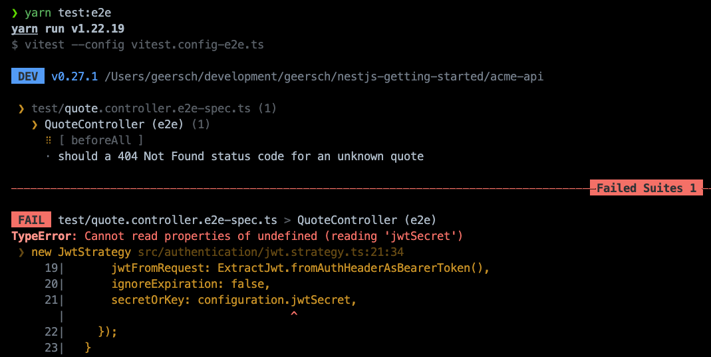
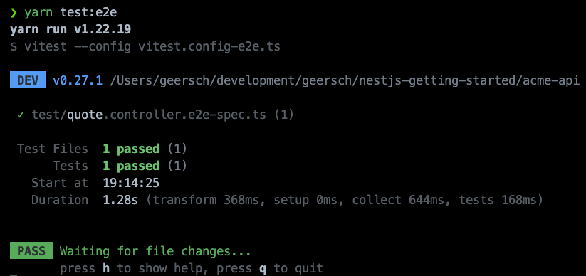
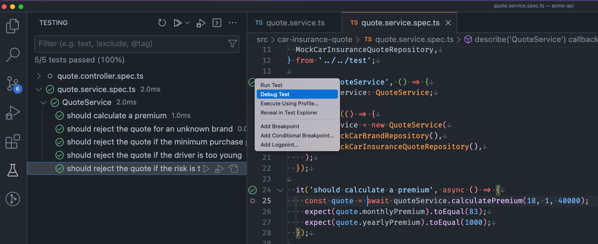

# Vitest

## Introducing Vitest

Vitest is a test framework that uses [Vite](https://vitejs.dev/) as a NodeJS runtime to run tests. Vite itself is a build tool to speed up development for modern web projects. It leverages new advancements in the JavaScript ecosystem such as ESM modules and provides a dev server that serves the source code over [native ESM](https://developer.mozilla.org/en-US/docs/Web/JavaScript/Guide/Modules). This lets the browser take over part of the job of a bundler. Vite only needs to transform and serve the requested source code.

Vitest relies on Vite which in turn uses [esbuild](https://esbuild.github.io/) to do the transpilation of TypeScript to JavaScript. It allows running JavaScript and TypeScript files on NodeJS using Vite's resolvers and transformers. It makes this possible via a package called [vite-node](https://github.com/vitest-dev/vitest/tree/main/packages/vite-node) which uses Vite as a NodeJS runtime. The Typescript code is transpiled into ESM modules (`ES6`) which Vitest then runs using `node-vite`. It handles the interoperability with CommonJS (CJS) modules. This allows you to use ESM features in your test files such as [top-level await](https://developer.mozilla.org/en-US/docs/Web/JavaScript/Reference/Operators/await#top_level_await). One caveat: know that the source code is transpiled differently during testing versus the build output.

Why Vitest instead of Jest? In my opinion, Vitest provides better isolation between test suites. Jest resets the [require cache](https://nodejs.org/api/modules.html#requirecache) between each test run isolating test suites from each other. A test suite can require and modify a module without it impacting another test suite. The other test suite gets its own separate copy.

There's a catch, Jest's ability to reset the require cache can only do so much. It cannot reset built-in NodeJS modules such as `fs`, `https`, `stream`...etc. If a third-party module monkey-patches a built-in module, that module cannot be reset and it will remain in memory. Anything referenced by that module also sticks around for the party. This is especially problematic if you run tests serially (`--runInBan`) as one process runs all the test suites sequentially and the memory usage of that process can grow quite large. You might even get the dreaded "JavaScript heap out of memory" error.

Diagnostic and analytical modules (e.g. [Application Insights](https://github.com/microsoft/ApplicationInsights-node.js)) or those that introduce async context tracking are the usual suspects, but any third-party module is free to monkey-patch a built-in module.

Vitest provides better isolation between test suites. It uses [workers](https://vitest.dev/config/#threads) not only for running test suites in parallel, but also to provide isolation. The memory usage of one test suite does not influence another.

## Removing Jest

When we started we scaffolded our application using the Nest CLI.

```sh
nest new acme-api
```

By default, it includes dependencies for the [Jest](https://jestjs.io/) testing framework and adds a unit and end-to-end test.

The initial project structure includes the following files.

```
.
├── src
│   ├── app.controller.spec.ts
│   ├── ...
│   └── main.ts
├── test
│   ├── app.e2e-spec.ts
│   └── jest-e2e.json
├── ...
└── package.json
```

Let's remove the following files if they are still present in your repository.

- `app.controller.spec.ts`
- `app.e2e-spec.ts` (Jest configuration for end-to-end tests)
- `jest-e2e.json`

Apart from these files we also need to remove all of Jest's dependencies.

```sh
yarn remove @types/jest jest ts-jest
```

And update our test scripts.

Replace

```json
{
  ...
  "scripts": {
    ...
    "test": "jest",
    "test:watch": "jest --watch",
    "test:cov": "jest --coverage",
    "test:debug": "node --inspect-brk -r tsconfig-paths/register -r ts-node/register node_modules/.bin/jest --runInBand",
    "test:e2e": "jest --config ./test/jest-e2e.json"
  },
  ...
}
```

with

```json
{
  ...
  "scripts": {
    ...
    "test": "vitest",
    "test:e2e": "vitest --config vitest.config-e2e.ts",
  },
  ...
}
```

Doesn't that look a lot cleaner? Personally, I don't like a lot of similar test scripts, one for each possible flag such as `--watch`, `--coverage`...etc. Just add them on the command-line and they will be passed along.

```sh
yarn test
yarn test --watch
yarn test --coverage
...
```

The last remaining thing is to remove the `jest` section from `package.json`. Go ahead and delete it. For Vitest we will add dedicated configuration files instead.

## Adding Vitest

### Configuring Vitest

Now that everything's been cleaned up we can start with a clean slate. Let's add Vitest.

```sh
yarn add -D vitest
```

**Remark**: Vitest requires Vite `>= v3.0.0` and Node `>= v14.0`.

To configure Vitest add a `vite.config.ts` to the root of the repository. For projects that use Vite this file already exists. Vitest configuration is unified with that of Vite. Everything is configured in the same file. In our setup, that's not the case so we have to configure it from scratch. Copy and paste the following configuration to the file.

```ts
/// <reference types="vitest" />
import { defineConfig } from 'vite';

export default defineConfig({
  plugins: [],
  test: {
    deps: {
      interopDefault: true,
    },
    environment: 'node',
    coverage: {
      provider: 'c8',
      reporter: ['text', 'html'],
    },
    reporters: 'default',
    include: ['**/*.spec.ts'],
  },
  root: '.',
});
```

Using [defineConfig](https://vitejs.dev/config) imported from `vite` we add a `test` section that contains the configuration for Vitest. Here we configure the environment (`node`), the test report (`default`), the coverage reporters (`test`, `html`), and the test files (`*.spec.ts`) to include and set `interopDefault` to `true` to make sure Vitest interprets CommonJS (CJS) module's default export as a named export. For more in-depth documentation about all the possible configuration options, consult the [Vitest documentation](https://vitest.dev/guide/).

Voila, you are now ready to run tests using Vitest. Just use the `test` script we set up earlier.

```ts
yarn test
```

Of course, we don't have any tests yet, so you'll get the following error.


Don't worry, we'll soon add some tests.

### UI

Vite, which powers Vitest, also provides a development server that allows it to also serve up a UI to visualize your tests. It's an optional dependency, but if you are interested you can install it.

```sh
yarn add -D @vitest-ui
```

Just pass the `--ui` flag when runnig the test script.

```sh
yarn test --ui
```


### Coverage

Another optional dependency you can install is one to calculate the code coverage. Vitest supports native code coverage via [c8](https://github.com/bcoe/c8) and instrumented code coverage via [istanbul](https://istanbul.js.org/).

For `c8`:

```sh
yarn add -D @vitest/coverage-c8
```

Or for `istanbul`:

```sh
yarn add -D @vitest/coverage-istanbul
```

You can then generate coverage by passing the `--coverage` flag to the test script.

```sh
yarn test --coverage
```


## Unit Tests

### Mocks

Before we can add some unit tests we'll have to add some mock implementations for the car brand and quote repositories. We don't want the unit tests to talk to the database. Rather we want to stub out this dependency and control the data ourselves.

Create a `test` folder in the root of the repository and add a `mocks` folder to it. Next, add a `mock-car-brand.repository.ts` and `mock-car-insurance-quote.repository.ts` file to the `mocks` folder and finally a barrel file (`index.ts`).

Your project structure should resemble this:

```
.
├── src
│   ├── ...
│   └── main.ts
├── test
│   └── mocks
│       ├── index.ts
│       ├── mock-car-brand.repository.ts
│       └── mock-car-insurance-quote.repository.ts
├── ...
└── package.json
```

Let's set up an in-memory list of car brands. Copy and paste the below code into the `mock-car-brand.repository.ts` file.

```ts
import {
  CarBrand,
  CarBrandRepository,
} from '../../src/car-insurance-quote/repositories';

const BRANDS: CarBrand[] = [
  {
    id: 1,
    name: 'Mercedes',
    minimumDriverAge: 18,
    yearlyPremium: 1000,
  },
  { id: 2, name: 'BMW', minimumDriverAge: 18, yearlyPremium: 1250 },
  { id: 3, name: 'Audi', minimumDriverAge: 18, yearlyPremium: 1500 },
  {
    id: 4,
    name: 'Porsche',
    minimumDriverAge: 25,
    yearlyPremium: 2500,
  },
];

export class MockCarBrandRepository extends CarBrandRepository {
  public async findById(id: number): Promise<CarBrand | null> {
    const brand = BRANDS.find((car) => car.id === id);
    return brand ?? null;
  }
}
```

We'll also store the quotes created during the tests in-memory. Add the following code to the `mock-car-insurance-quote.repository.ts` file.

```ts
import {
  CarInsuranceQuote,
  CarInsuranceQuoteRepository,
} from '../../src/car-insurance-quote/repositories';

export class MockCarInsuranceQuoteRepository extends CarInsuranceQuoteRepository {
  private quotes: CarInsuranceQuote[] = [];

  public async save(
    ageOfDriver: number,
    monthlyPremium: number,
    yearlyPremium: number
  ): Promise<CarInsuranceQuote> {
    const quote = {
      id: this.quotes.length + 1,
      ageOfDriver,
      monthlyPremium,
      yearlyPremium,
      createdOn: new Date(),
    };
    this.quotes.push(quote);
    return quote;
  }

  public async load(id: number): Promise<CarInsuranceQuote | null> {
    const quote = this.quotes.find((quote) => quote.id === id);
    return quote ?? null;
  }
}
```

It's simple, but for testing purposes, it suffices.

Last, but not least let's export these mocks through the barrel file (`index.ts`) file.

```ts
export * from './mock-car-brand.repository';
export * from './mock-car-insurance-quote.repository';
```

### Tests

Let's start by adding some tests for the `QuoteService`. Add a `quote.service.spec.ts` file next to the `quote.service.ts` file. Copy and paste the below code in it.

```ts
import { beforeEach, describe, expect, it } from 'vitest';
import { QuoteService } from './quote.service';
import {
  DriveTooYoungError,
  PurchasePriceTooLowError,
  RiskTooHighError,
  UnknownCarBrandError,
} from './errors';
import {
  MockCarBrandRepository,
  MockCarInsuranceQuoteRepository,
} from '../../test';

describe('QuoteService', () => {
  let quoteService: QuoteService;

  beforeEach(() => {
    quoteService = new QuoteService(
      new MockCarBrandRepository(),
      new MockCarInsuranceQuoteRepository()
    );
  });

  ...
});
```

As you can see we don't rely on NestJS's dependency injection system to create a `QuoteService` instance for us. Instead, we create it ourselves and pass in instances of the mock repositories we created earlier. This way we stub out the dependency on the database and know which data the tests work with.

Now let's add the following tests below the `beforeEach` block.

```ts
it('should calculate a premium', async () => {
  const quote = await quoteService.calculatePremium(18, 1, 40000);
  expect(quote.monthlyPremium).toEqual(83);
  expect(quote.yearlyPremium).toEqual(1000);
});

it('should reject the quote for an unknown brand', async () => {
  await expect(() =>
    quoteService.calculatePremium(18, 101, 37500)
  ).rejects.toThrow(UnknownCarBrandError);
});

it('should reject the quote if the minimum purchase price is too low', async () => {
  await expect(() =>
    quoteService.calculatePremium(18, 2, 4000)
  ).rejects.toThrow(PurchasePriceTooLowError);
});

it('should reject the quote if the driver is too young', async () => {
  await expect(() =>
    quoteService.calculatePremium(17, 3, 55000)
  ).rejects.toThrow(DriveTooYoungError);
});

it('should reject the quote if the risk is too high', async () => {
  await expect(() =>
    quoteService.calculatePremium(18, 4, 75000)
  ).rejects.toThrow(RiskTooHighError);
});
```

We added 5 tests that each test a different case that can occur when calculating a quote. We want to be sure that the minimum age is respected, that the risk is not too high, the driver is not too young...etc.

If you now run the tests, you should see that the tests succeed.

```sh
yarn test
```


You also configure another [reporter](https://vitest.dev/config/#reporters) (e.g. `verbose`) to see more information about the tests that were executed. The `default` reporter collapses tests suites once executed.


Should one or more of the tests fail, you'll see more detailed information.


## End-to-end (e2e) Tests

Let's also create a simple end-to-end (e2e) test. Add a file called `quote.controller.e2e-spec.ts` to the `test` folder in the root of the repository.

```
.
├── src
│   ├── ...
│   └── main.ts
├── test
│   ├── mocks
│   │   └── ...
│   ├── ...
│   └── quote.controller.e2e-spec.ts
├── ...
└── package.json
```

I like to keep my unit tests (`*.spec.ts`) next to the code being tested and my e2e tests (`*.e2e-spec.ts`) in a separate folder. Also, note the different file extensions between them.

Copy and paste the following code into the file.

```ts
import { afterAll, beforeAll, describe, it } from 'vitest';
import { Test, TestingModule } from '@nestjs/testing';
import { INestApplication } from '@nestjs/common';
import request from 'supertest';
import { AppModule } from './../src/app.module';

describe('QuoteController (e2e)', () => {
  let app: INestApplication;

  beforeAll(async () => {
    const moduleFixture: TestingModule = await Test.createTestingModule({
      imports: [AppModule],
    }).compile();

    app = moduleFixture.createNestApplication();
    await app.init();
  });

  afterAll(async () => {
    await app.close();
  });

  ...
});
```

Using the `Test` utility class from the [@nestjs/testing](https://docs.nestjs.com/fundamentals/testing#testing-utilities) package we spin up a NestJS application that we can test against. Using [supertest](https://github.com/ladjs/supertest) we can perform an HTTP request against our REST API that involves the whole stack and perform expectations against the response.

We'll just add one test to this test suite which does a simple `GET` request to retrieve a quote and verifies that the request is authenticated. It must return a `401 Unauthorized` status code.

```ts
it('should return a 401 Unauthorized status code when retrieving a quote', () => {
  return request(app.getHttpServer()).get('/quote/9001').expect(401).expect({
    message: 'Unauthorized',
    statusCode: 401,
  });
});
```

Since it's an e2e test it will contact the database, so make sure you have the Docker container running Postgres up and running. If you integrate the e2e tests into your CI environment, you'll need to spin up a Docker image every time with a fresh database so can test from scratch every time you run the tests. We'll leave that exercise for another time. For now, we'll just run it locally.

Let us first create a dedicated Vitest configuration for the e2e tests. Add a new file called `vitest.config-e2e.ts` to the root of the repository.

```ts
/// <reference types="vitest" />
import { defineConfig, loadEnv } from 'vite';

export default defineConfig(({ mode }) => {
  Object.assign(process.env, loadEnv(mode, process.cwd(), ''));

  return {
    plugins: [],
    test: {
      deps: {
        interopDefault: true,
      },
      environment: 'node',
      coverage: {
        provider: 'c8',
        reporter: ['text', 'html'],
      },
      reporters: 'default',
      include: ['**/*.e2e-spec.ts'],
    },
    root: '.',
  };
});
```

This configuration is slightly different from the one used for the unit tests. We use a different glob for including the test suites (`**/*.e2e-spec.ts`).
More importantly, we pass a callback function to Vite's `defineConfig` function which gives us access to the mode (among other things) it is being executed in.
This defaults to `test`. We use the `loadEnv` helper function to load a `.env` file, `env.test` in this case, and assign its properties to `process.env` to make sure these environment variables are known to the process running the tests.
The `.gitignore` file excludes `.env` files from being committed since they might contain sensitive information, but here you would add your JWT secret, database user and password...etc. to make sure that you can run the NestJS application locally or in your CI environment when executing the e2e tests.

For running the e2e tests you only need to include 2 environment variables in the `.env.test` file.

```
JWT_SECRET = 'top-secret'
DATABASE_URL = 'postgresql://localhost:5432/acme'
```

Add this file to the root of the repository and change the values to match your local and/or CI environment.

OK, we're all set, let's run the tests.

```sh
yarn test:e2e
```



Hey, what gives? That's a bit weird. Vitest relies on Vite which in turn uses [esbuild](https://esbuild.github.io/) to do the transpilation of TypeScript to JavaScript. At the moment esbuild does not emit decorator metadata which is required by NestJS. NestJS uses the metadata emitted by its many decorators to automagically make its dependency injection system work. Since we are spinning up a NestJS application to test we are no longer creating and injecting the dependencies ourselves. Remember the mock repositories from the unit tests? For the unit tests, we do not rely on NestJS's DI, but for the e2e tests, we do.

If we stick to the rule that we do not use NestJS's DI for the unit test and only for the e2e tests we can keep using esbuild for the unit tests, but for the e2e tests, we'll have to come up with a different approach. That's why we created two separate configurations for Vitest. One for the unit tests and one for the e2e tests.

For the e2e tests, we'll use [SWC](https://swc.rs/) (Speedy Web Compiler) to do the transpilation. It's a TypeScript transpiler written in Rust and it supports emitting decorator metadata. Vite offers a handy [plugin API](https://vitejs.dev/guide/api-plugin.html) that we can use for this purpose.

There already is a third-party plugin that we can use to switch from esbuild to SWC, namely [unplugin-swc](https://www.npmjs.com/package/unplugin-swc).

Install it.

```sh
yarn -D add unplugin-swc @swc/core -D
```

And modify the `vitest.config-e2e.ts` file to load it.

```ts
/// <reference types="vitest" />
import { defineConfig, loadEnv } from 'vite';
import swc from 'unplugin-swc';

export default defineConfig(({ mode }) => {
  ...

  return {
    plugins: [swc.vite()],
    test: {
      ...
    },
    ...
  };
});
```

You just need to import the `swc` plugin and register it in the `plugins` option. It will disable `esbuild` for you and use `SWC` to do the transpilation.

Let's run the tests again.



Ah, that's better!

## Debugging

### Launch Configuration

To debug a test file in VSCode Vitest recommends the following launch configuration:

```json
{
  "version": "0.2.0",
  "configurations": [
    {
      "type": "node",
      "request": "launch",
      "name": "Debug Current Test File",
      "autoAttachChildProcesses": true,
      "skipFiles": ["<node_internals>/**", "**/node_modules/**"],
      "program": "${workspaceRoot}/node_modules/vitest/vitest.mjs",
      "args": ["run", "${relativeFile}"],
      "smartStep": true,
      "console": "integratedTerminal"
    }
  ]
}
```

In the debug tab, select `Debug Current Test File`, open the test suite you want to debug, and press `F5` to start debugging.

I experienced issues with this launch configuration. At the time of writing, it took forever for the first breakpoint to be hit. I debugged this for quite some time and found out it was due to the `Just My Code` feature. Using the [skipFiles](https://code.visualstudio.com/docs/nodejs/nodejs-debugging#_skipping-uninteresting-code) option you can specify glob patterns for script paths that the built-in debugger for NodeJS should skip. In the above configuration it is set to `["<node_internals>/**", "**/node_modules/**"]`. The huge amount of files in `node_modules` is what makes it extremely slow. I could reproduce this with Jest as well and apparently, it has been [reported before](https://github.com/microsoft/vscode-js-debug/issues/117) before. This issue is closed and supposedly resolved, but it did not solve anything for me. In the end, I just removed the `skipFiles` and `smartStep` options and everything started working smoothly.

By default, this launch configuration will start Vitest without the `--config` flag so it will use the configuration exported by the `vitest.config.ts` file, which is great for debugging the unit tests, but it won't work for debugging the e2e tests. We can quickly remedy this by adding a new launch configuration just for the e2e tests and passing the correct configuration via the arguments option.

I have 2 launch configurations, one for debugging unit tests and one for debugging e2e tests.

```json
{
  "version": "0.2.0",
  "configurations": [
    {
      "type": "node",
      "request": "launch",
      "name": "Debug Current Unit Test Suite",
      "autoAttachChildProcesses": true,
      "program": "${workspaceRoot}/node_modules/vitest/vitest.mjs",
      "args": ["run", "${relativeFile}"],
      "console": "integratedTerminal"
    },
    {
      "type": "node",
      "request": "launch",
      "name": "Debug Current e2e Test Suite",
      "autoAttachChildProcesses": true,
      "program": "${workspaceRoot}/node_modules/vitest/vitest.mjs",
      "args": ["run", "${relativeFile}", "--config", "vitest.config-e2e.ts"],
      "console": "integratedTerminal"
    }
  ]
}
```

### VSCode Extension

Vitest also offers a VSCode extension to run and debug tests. It's currently in preview and you can find it on the marketplace.

https://marketplace.visualstudio.com/items?itemName=ZixuanChen.vitest-explorer



However, it suffers from the same issue mentioned in the previous point as it hardcodes the launch configuration suggested by Vitest.

https://github.com/vitest-dev/vscode/blob/306eda3f14802a2905f4fa9be71826147cc0d7d7/src/runHandler.ts#L288

I made a pull request to make `skipFiles` configurable for the plugin. At the time of writing it has not been reviewed/merged yet. Let's hope that will happen soon. You can always fork the extension, modify it and package it yourself or just use the launch configurations.

You might experience other issues with the plugin, but in most cases, it works sufficiently well and it is regularly worked on and improved.

## Caveats

### Jest Compatible

Should you happen to have already written tests using Jest, then rest assured migrated to Vitest is straightforward. Vitest has been designed with a Jest-compatible API. Except, snapshots, code coverage, and more are all supported.

- `jest.mock()` becomes `vi.mock()`
- `jest.setTimeout()` becomes `vi.setConfig({ hookTimeout, testTimeout })`
- `jest.fn()` becomes `vi.fn()`
- ...

For more information consult this migration guide:

https://vitest.dev/guide/migration.html

### Hooks

There are some subtle differences between how Vitest and Jest deal with the `beforeAll`, `beforeEach`, `afterAll`, and `afterEach` hooks. Jest executes them sequentially in the order they were declared, but Vitest runs run them in parallel. If you happen to rely upon this behavior you can change the order in which the hooks are executed via the `sequence.hooks` option.

https://vitest.dev/config/#sequence-hooks

Another difference is that you can return a clean-up function from a hook which is called once after all tests are run.

```ts
import { beforeAll } from 'vitest';

beforeAll(async () => {
  // called once before all tests run
  await startMocking();

  // clean up function, called once after all tests run
  return async () => {
    await stopMocking();
  };
});
```

### Namespace Imports

The test suites (`*.spec.ts`, `*.e2e-spec.ts`) are transpiled to ESM. Because of this, [namespace imports](https://developer.mozilla.org/en-US/docs/Web/JavaScript/Reference/Statements/import#namespace_import) (`import * from`) might break.

```ts
import * request from 'supertest';

describe('test suite', () => {
  it('GET /quote/:id', () => {
    ...
    request(app)
      .get('/quote/1')
      .expect(200);
  })
});
```

Invoking `request()` is illegal to the ES6 spec. A namespace import creates an identifier that is a module object. This object should contain the named exports, including the default export. It should never be callable or newable. This might work in some runtime and transpilation environments, but it is not valid. It might break at any point in the future.

Avoid this syntax unless it is valid. For test suites you can just replace:

```ts
import * request from 'supertest';
```

with

```ts
import request from 'supertest';
```

Using the default import from the module will work fine when running the tests. For dependencies that are also used by the application, you might have to resort to using `require`, but do apply this only when necessary.
